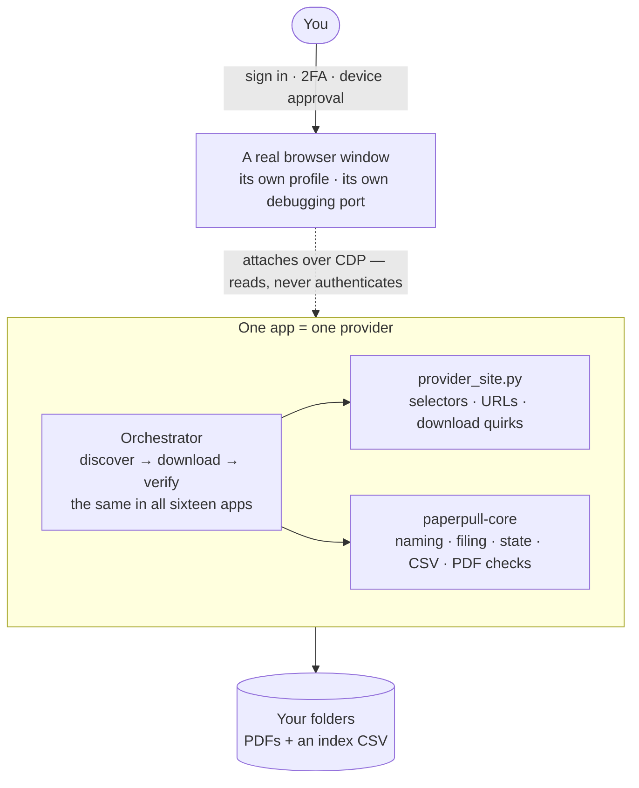
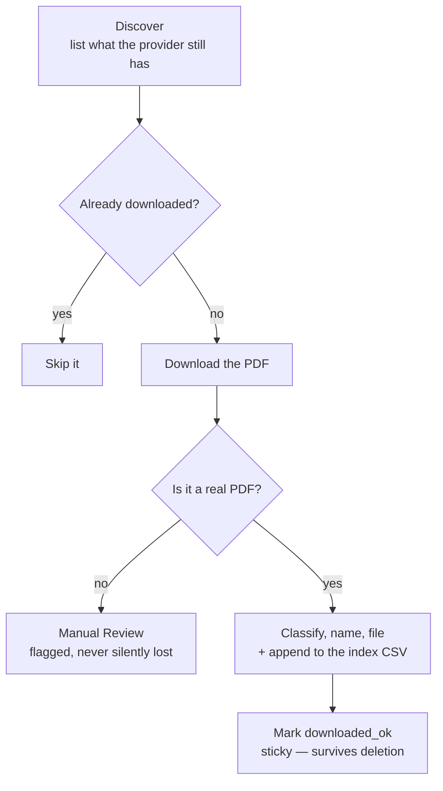

# PaperPull


[](https://ko-fi.com/rheeloaded)

**Receipt & Statement Downloader** — a family of small, **read-only** tools that log in *alongside you* to your own
accounts and download your **statements and receipts** as PDFs — so you can
archive them (e.g. into [paperless-ngx](https://docs.paperless-ngx.com/)) instead
of clicking through each site by hand.

Runs on **Windows and macOS** (and Linux), with the same commands on each.

Sixteen providers are supported today, all built on the same pattern:

| App | Provider | Documents | Notes |
|-----|----------|-----------|-------|
| [`ally`](apps/ally) | Ally Bank | Account statements, tax forms | JSON API; same-dated statements named from the PDF |
| [`amazon`](apps/amazon) | Amazon | Order invoices (full history) | Per-year order pagination |
| [`amex`](apps/amex) | American Express | Statements, Year-End Summary | Click-nav SPA; in-memory session |
| [`chase`](apps/chase) | Chase (credit cards) | Card statements | Real Edge/Chrome; per-card accordions + year picker |
| [`dominion`](apps/dominion) | Dominion Energy (VA) | Billing statements | Paginated MUI accordion; ~18-month limit |
| [`gap`](apps/gap) | Gap Inc. (Gap, Old Navy, Banana Republic, Athleta) | Order receipts | Lazy-loading history; ~13-month limit |
| [`navyfederal`](apps/navyfederal) | Navy Federal CU | Account statements | Per-account accordions; blob-tab PDFs |
| [`redcard`](apps/redcard) | Target RedCard / Circle Card (TD Bank) | Billing statements | Statements table; per-year switcher |
| [`robinhood`](apps/robinhood) | Robinhood | Account statements, tax docs | "View More" pagination |
| [`target`](apps/target) | Target | Receipts (Online + In-Store) | Print-capture |
| [`tmobile`](apps/tmobile) | T-Mobile | Bill statements | Bill-history page; detailed-bill download |
| [`ukg`](apps/ukg) | UKG Pro / UltiPro | **Pay statements** | Per-employer tenant; JSON-API, nothing clicked |
| [`usaa`](apps/usaa) | USAA | Statements | JSON-API enumeration |
| [`verizon`](apps/verizon) | Verizon (Fios) | Bill statements | Real Edge (bot block); dropdown + CDP download |
| [`walmart`](apps/walmart) | Walmart | Receipts | Hardened against bot detection |
| [`wealthfront`](apps/wealthfront) | Wealthfront | Statements, tax docs | |

> ⚠️ **Read this first:** these tools drive real, signed-in financial accounts.
> See [SECURITY.md](SECURITY.md) before you run *or* publish anything. In short:
> never commit your `*-browser-profile/` folder, your `config.json`, or any
> downloaded PDF. The `.gitignore` blocks them — don't override it.

## How it works (the shared design)

### The one decision everything follows from

Your documents live on the provider's site, and it will only hand them to a
browser that is already signed in. So PaperPull never tries to *be* you — it
works *beside* you. You sign in yourself, in a real browser window, and the
tool attaches to that window afterwards and reads.



That single choice is why there is no password anywhere in this project, why
2FA and device approvals are never an obstacle, and why a provider tightening
its login breaks nothing here.

In practice that first step is `login.bat` (or `./login.command`), which opens
the browser for you — a plain Chromium for most apps, or your own installed
Edge/Chrome for the few sites whose bot detection turns a fresh Chromium away
(Walmart, Verizon). Each app gets its own profile and its own debugging port,
so several signed-in browsers can sit open at once without colliding.

**Everything a provider knows lives in one file.** `provider_site.py` holds
every selector, URL and download quirk for that site. The orchestrator around
it is the same in all sixteen apps, and `paperpull-core` underneath it is
shared. When a provider redesigns, the repair is one file — never a rewrite,
and never a change to how documents get named, filed or tracked.

### What one run actually does



Three plain-text files carry the state, and you can read all of them:

| File | Holds |
|------|-------|
| `discovery.json` | what the provider showed us this run |
| `progress.json` | what happened to each document — including the sticky `downloaded_ok` |
| `<Provider> Index.csv` | one row per saved document, for humans and spreadsheets |

That last step is what makes a re-run safe. `downloaded_ok` is keyed to the
document, not to the file on disk — so you can import everything into
paperless-ngx, delete the PDFs, and the next run still skips them. It only
fetches what is genuinely new, and lists it in `new-this-run.txt`.

### Read-only by construction

Nothing that buys, sells, transfers, pays, deletes, or changes a setting is
ever clicked, and all site interaction lives in `provider_site.py` where it can
be read in one sitting. The statement apps enforce this deny-by-default — a
control must clear a blocklist (`FORBIDDEN_CONTROL_RE`) *and* match a document
allowlist (`SAFE_DOC_CONTROL_RE`). The receipt apps screen a narrow
print/invoice pattern against the blocklist. Gap and UKG click nothing at all.
[SECURITY.md](SECURITY.md) spells out which app does which.

### One app, more than one person

A `--config config.<name>.json` flag lets one app serve a second person's
account with its own profile, port and output folders, so no data mixes. The
launchers take the account label as an argument (`login.bat spouse` /
`./login.command spouse`).

## Run it in Docker

**This fork's supported path.** The control panel becomes a web UI you reach
from any device, and the sign-in browser becomes a real Google Chrome with a
web desktop in its own container. You still sign in yourself; PaperPull still
attaches afterwards over the DevTools protocol and never sees a password.

```bash
cp .env.example .env         # set BROWSER_PASSWORD and PAPERPULL_ALLOWED_HOSTS
docker network create proxy  # if your reverse proxy doesn't have one
docker compose up -d
```

Then add the two blocks from [`docker/Caddyfile.example`](docker/Caddyfile.example)
to your Caddyfile, sign in to a provider on the browser desktop, and drive it
from the panel. Full setup, the four Chrome/Playwright gotchas the design works
around, and how to verify it: **[docs/docker.md](docs/docker.md)**.

> ⚠️ This exposes a browser that is signed in to your accounts. Read the
> Docker section of [SECURITY.md](SECURITY.md) first — the threat model is not
> the same as a localhost-only install.

Images publish from CI: `:latest` from `main`, `:beta` from `develop`.

```
ghcr.io/zjean/paperpull:latest
```

This fork tracks [rheeloaded/paperpull](https://github.com/rheeloaded/paperpull)
for new providers — see [docs/upstream.md](docs/upstream.md).

## Quick start (native)

> The `.bat` / `.command` launchers below are upstream's, and still work, but
> are **unmaintained in this fork**. Docker is the supported path.


**One-shot setup** (creates a venv for every app + the GUI, installs the browser):

```bat
setup-all.bat        REM Windows
```

```bash
./setup-all.command  # macOS / Linux
```

Then either drive everything from the **[GUI control panel](gui)** — pick an
app and account, click an action, and watch the live output:

```bat
gui\run_gui.bat
```


…or run a single app directly (using `amex` as the example):

```bat
cd apps\amex
copy config.example.json config.json    REM then edit paths as needed
login.bat                 REM opens Chromium — sign in yourself, leave it OPEN
run_pilot.bat             REM download the newest few as a test
run_all.bat               REM download everything available
```

Each app also has its own README with provider-specific details and quirks.
(Prefer to set apps up one at a time? Each has its own `setup.bat` / `setup.command`.)

## Windows and macOS

One download covers both. Every app ships two launchers with the same names
and the same behaviour — `.bat` for Windows, `.command` for macOS and Linux —
so the instructions in this README and in each app's own README apply
wherever you are:

| Task | Windows | macOS / Linux |
|------|---------|---------------|
| One-shot setup | `setup-all.bat` | `./setup-all.command` |
| Set up one app | `setup.bat` | `./setup.command` |
| Sign in | `login.bat` | `./login.command` |
| Test run | `run_pilot.bat` | `./run_pilot.command` |
| Full run | `run_all.bat` | `./run_all.command` |
| Control panel | `gui\run_gui.bat` | `gui/run_gui.command` |

A second account is the same on both: `run_all.bat spouse` /
`./run_all.command spouse`.

Only one thing genuinely differs. macOS keeps Playwright's browser inside an
app bundle and in a different cache directory, and a couple of providers need
a branded Edge/Chrome to get past their bot protection — that lookup lives in
`paperpull_core.browser` and is handled for you.

### Getting it onto a Mac

**`git clone` is the smoothest route** — it preserves the scripts' executable
bit and macOS does not quarantine it.

If you download a release archive instead, prefer the **`.tar.gz`**: it keeps
the executable bit, while a `.zip` drops it. After unpacking a download,
macOS may also quarantine the scripts, so a double-click reports *"cannot be
opened because it is from an unidentified developer."* Both are cleared in one
go:

```bash
xattr -dr com.apple.quarantine .
chmod +x setup-all.command apps/*/*.command gui/*.command
```

## Requirements

- **Windows, macOS, or Linux**
- Python 3.11+
- Playwright (installed per app by the setup script)

## Contributing — add your provider

No one has accounts everywhere, so **PaperPull grows when people add the
providers they use.** If a bank, card, brokerage, utility, telecom, or retailer
you use isn't here yet, you're the ideal person to add it:

- 📖 **[Adding a provider](docs/adding-a-provider.md)** — a step-by-step guide
  (clone the closest app, rewrite one file, stay read-only, test, submit).
- 📋 **[PROVIDERS.md](PROVIDERS.md)** — what's supported and what's requested;
  claim one so nobody builds it twice.
- 📥 Can't build it yourself? [Request a provider](https://github.com/rheeloaded/paperpull/issues/new/choose)
  and someone with that account may pick it up.

Every contribution keeps the **read-only, local, no-credentials** design — see
[CONTRIBUTING.md](CONTRIBUTING.md) and [SECURITY.md](SECURITY.md).

## Status & roadmap

- ✅ All **sixteen** apps work and are in regular use.
- 🔜 **More providers:** community-driven — see [PROVIDERS.md](PROVIDERS.md).
- 🔜 **Scheduled/assisted runs:** a monthly "nudge + sweep" (e.g. the 1st) that
  opens the login browsers and then runs discover + resume across every app once
  you've signed in — delete-safe, so it only grabs what's new. Fully unattended
  runs stay out of scope by design: the tools never store credentials or bypass
  2FA, so a human sign-in stays in the loop (long-session retailer apps may
  tolerate more automation than banks/cards).
- ✅ **Shared core:** the support code the apps used to duplicate now lives once
  in [`core/`](core) as `paperpull-core`. An app declares an `AppSpec` — its
  folders, routing, CSV columns and config defaults — and keeps only its
  orchestrator and its `*_site.py`. `tools/check_installs.py` reports whether
  your installs have drifted from the repo.

## Support

If PaperPull saves you time, you can support its development on Ko-fi:
**[ko-fi.com/rheeloaded](https://ko-fi.com/rheeloaded)** ☕. Entirely optional and
much appreciated — it doesn't change anything below.

## Legal

This project is for **personal archival of your own records**. It is not
affiliated with, endorsed by, or sponsored by any of the companies listed.
All product names and trademarks are the property of their respective owners.
Automating access to a website may be restricted by that site's Terms of
Service — you are responsible for how you use these tools. Provided **as-is,
without warranty of any kind** (see [LICENSE](LICENSE)).
