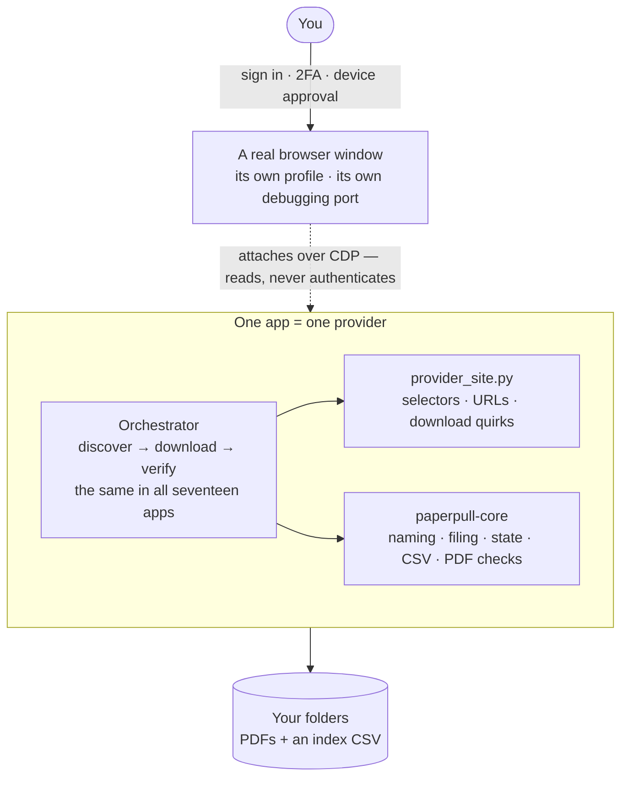
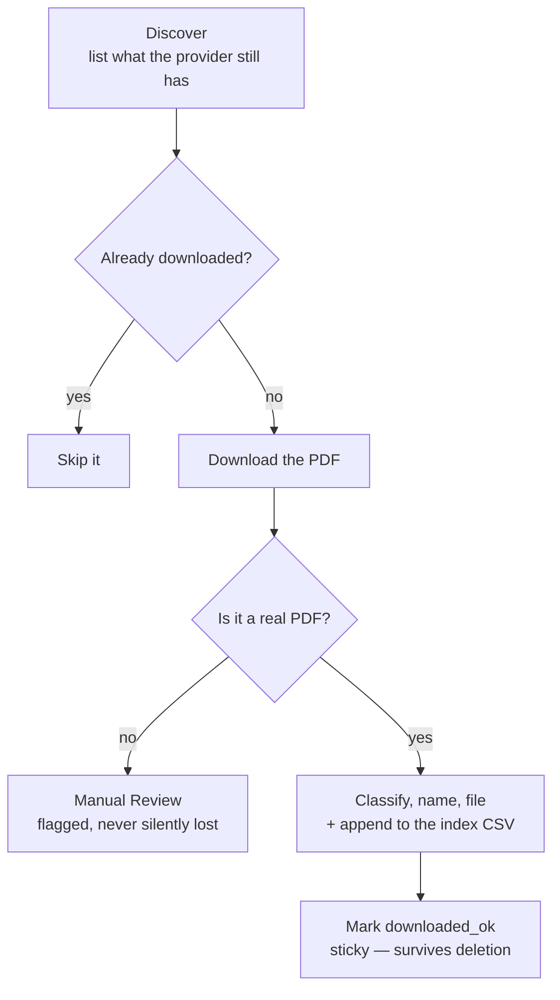
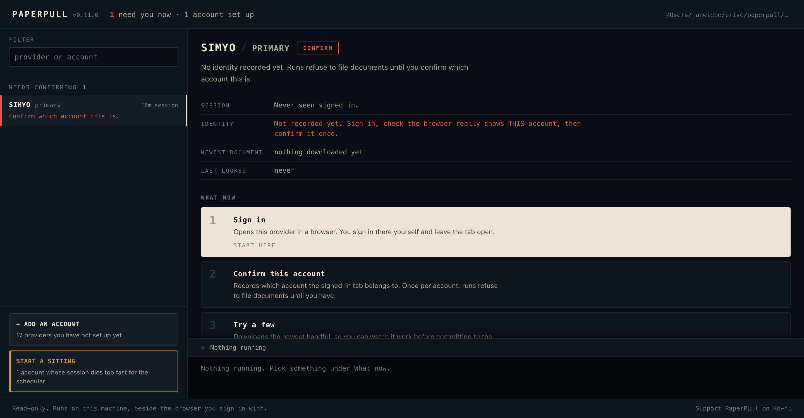

# PaperPull


[](https://ko-fi.com/rheeloaded)

**Receipt & Statement Downloader** — a family of small, **read-only** tools that log in *alongside you* to your own
accounts and download your **statements and receipts** as PDFs — so you can
archive them (e.g. into [paperless-ngx](https://docs.paperless-ngx.com/)) instead
of clicking through each site by hand.

Runs on **Windows and macOS** (and Linux), with the same commands on each.

Twenty-three providers are supported today, all built on the same pattern:

| App | Provider | Documents | Notes |
|-----|----------|-----------|-------|
| [`aafmaa`](apps/aafmaa) | AAFMAA (Armed Forces Mutual) | Annual statements, policy docs | ASP.NET WebForms; one documented disclosure dialog |
| [`ally`](apps/ally) | Ally Bank | Account statements, tax forms | JSON API; same-dated statements named from the PDF |
| [`amazon`](apps/amazon) | Amazon | Order invoices (full history) | Per-year order pagination |
| [`amex`](apps/amex) | American Express | Statements, Year-End Summary | Click-nav SPA; in-memory session |
| [`chase`](apps/chase) | Chase (credit cards) | Card statements | Real Edge/Chrome; per-card accordions + year picker |
| [`discovercard`](apps/discovercard) | Discover (credit cards) | Card statements | Direct PDF URLs; whole index in one read; ~2-year limit |
| [`dominion`](apps/dominion) | Dominion Energy (VA) | Billing statements | Paginated MUI accordion; ~18-month limit |
| [`gap`](apps/gap) | Gap Inc. (Gap, Old Navy, Banana Republic, Athleta) | Order receipts | Lazy-loading history; ~13-month limit |
| [`mypay`](apps/mypay) | DFAS myPay | eRAS, CRSC, 1099-R, 1095 | Government pay system; JSON API, nothing clicked |
| [`mtb`](apps/mtb) | M&T Bank | Mortgage statements, escrow, 1098 | Own online banking; you list, app expands all years |
| [`navyfederal`](apps/navyfederal) | Navy Federal CU | Account statements | Per-account accordions; blob-tab PDFs |
| [`paylocity`](apps/paylocity) | Paylocity | **Pay statements** | Escher JSON API, enqueue-poll-fetch PDF; nothing clicked |
| [`redcard`](apps/redcard) | Target RedCard / Circle Card (TD Bank) | Billing statements | Statements table; per-year switcher |
| [`robinhood`](apps/robinhood) | Robinhood | Account statements, tax docs | "View More" pagination |
| [`simyo`](apps/simyo) | Simyo (NL) | Invoices (facturen) | JSON API, nothing clicked; one tab only — a second signs you out |
| [`target`](apps/target) | Target | Receipts (Online + In-Store) | Print-capture |
| [`tmobile`](apps/tmobile) | T-Mobile | Bill statements | Bill-history page; detailed-bill download |
| [`ukg`](apps/ukg) | UKG Pro / UltiPro | **Pay statements** | Per-employer tenant; JSON-API, nothing clicked |
| [`usaa`](apps/usaa) | USAA | Statements | JSON-API enumeration |
| [`verizon`](apps/verizon) | Verizon (Fios) | Bill statements | Real Edge (bot block); dropdown + CDP download |
| [`walmart`](apps/walmart) | Walmart | Receipts | Hardened against bot detection |
| [`wealthfront`](apps/wealthfront) | Wealthfront | Statements, tax docs | |
| [`youfone`](apps/youfone) | Youfone (NL) | Invoices + specifications (facturen) | Clicked, not fetched: API needs their own `securitykey` header |

> ⚠️ **Read this first:** these tools drive real, signed-in financial accounts.
> See [SECURITY.md](SECURITY.md) before you run *or* publish anything. In short:
> never commit your `*-browser-profile/` folder, your `config.json`, or any
> downloaded PDF. The `.gitignore` blocks them — don't override it.

## How it works (the shared design)

### The one decision everything follows from

Your documents live on the provider's site, and it will only hand them to a
browser that is already signed in. So PaperPull never tries to *be* you — it
works *beside* you. You sign in yourself, in a real browser window, and the
tool attaches to that window afterwards and reads.



That single choice is why there is no password anywhere in this project, why
2FA and device approvals are never an obstacle, and why a provider tightening
its login breaks nothing here.

In practice that first step is `login.bat` (or `./login.command`), which opens
the browser for you — a plain Chromium for most apps, or your own installed
Edge/Chrome for the few sites whose bot detection turns a fresh Chromium away
(Walmart, Verizon). Each app gets its own profile and its own debugging port,
so several signed-in browsers can sit open at once without colliding.

**Everything a provider knows lives in one file.** `provider_site.py` holds
every selector, URL and download quirk for that site. The orchestrator around
it is the same in all seventeen apps, and `paperpull-core` underneath it is
shared. When a provider redesigns, the repair is one file — never a rewrite,
and never a change to how documents get named, filed or tracked.

### What one run actually does



Three plain-text files carry the state, and you can read all of them:

| File | Holds |
|------|-------|
| `discovery.json` | what the provider showed us this run |
| `progress.json` | what happened to each document — including the sticky `downloaded_ok` |
| `<Provider> Index.csv` | one row per saved document, for humans and spreadsheets |

That last step is what makes a re-run safe. `downloaded_ok` is keyed to the
document, not to the file on disk — so you can import everything into
paperless-ngx, delete the PDFs, and the next run still skips them. It only
fetches what is genuinely new, and lists it in `new-this-run.txt`.

### Read-only by construction

Nothing that buys, sells, transfers, pays, deletes, or changes a setting is
ever clicked, and all site interaction lives in `provider_site.py` where it can
be read in one sitting. The statement apps enforce this deny-by-default — a
control must clear a blocklist (`FORBIDDEN_CONTROL_RE`) *and* match a document
allowlist (`SAFE_DOC_CONTROL_RE`). The receipt apps screen a narrow
print/invoice pattern against the blocklist. Gap and UKG click nothing at all.
[SECURITY.md](SECURITY.md) spells out which app does which.

### One app, more than one person

A `--config config.<name>.json` flag lets one app serve a second person's
account with its own profile, port and output folders, so no data mixes. The
launchers take the account label as an argument (`login.bat spouse` /
`./login.command spouse`).

## Deploy it to a server

**This fork's supported path.** The control panel becomes a web UI you reach
from any device, and the sign-in browser becomes a real Google Chrome with a web
desktop in its own container. You still sign in yourself; PaperPull still
attaches afterwards over the DevTools protocol and never sees a password.

Two containers, behind your own reverse proxy:

| Service | Is | Proxy it as |
|---|---|---|
| `browser` | real Google Chrome + a web desktop. **You sign in here.** | `browser.<you>` → `browser:3000` |
| `paperpull` | the control panel and all seventeen apps | `paperpull.<you>` → `paperpull:8765` |

> ⚠️ **Read the Docker section of [SECURITY.md](SECURITY.md) first.** This puts a
> browser that is *already signed in to your bank* on your network. Whoever
> reaches it needs no password and faces no 2FA. That is a different threat
> model from a localhost-only install, and it deserves a real password, real
> auth in front of the panel, and no exposure to the open internet.

### What you need

- Docker with Compose v2, on **amd64 or arm64** (both are built).
- A reverse proxy on a Docker network named `proxy`.
- **~6 GB of disk** for the images — the browser one is 4.5 GB, because it
  contains a real Chrome and a desktop.
- Two DNS names pointing at the server.

### 1. Publish the images (once)

CI builds them, but nothing exists until a branch is pushed:

```bash
git push -u origin develop     # builds :beta
# happy with :beta? then
git switch main && git merge develop && git push   # builds :latest
```

Two images, both `linux/amd64` and `linux/arm64`:

| | |
|---|---|
| `ghcr.io/zjean/paperpull` | the panel and the seventeen apps |
| `ghcr.io/zjean/paperpull-browser` | Chrome, the desktop, and the CDP bridge |

Because this repo is public, both packages inherit public visibility and your
server can pull them with no login. If you ever make the repo private, GHCR
packages become private too — then either flip them back at
*github.com/zjean?tab=packages → the package → Package settings → Change
visibility*, or log the server in once with a classic PAT carrying only
`read:packages`:

```bash
echo "$GHCR_READ_TOKEN" | docker login ghcr.io -u zjean --password-stdin
```

### 2. Set it up on the server

```bash
git clone https://github.com/zjean/paperpull.git /opt/paperpull
cd /opt/paperpull
cp .env.example .env
$EDITOR .env
```

Fill in at least these:

```ini
# Your own user, so the downloaded PDFs are yours on the host, not root's.
PUID=1000                # <- id -u
PGID=1000                # <- id -g

BROWSER_PASSWORD=<a real password — it guards a signed-in bank session>
PAPERPULL_ALLOWED_HOSTS=paperpull.example.com
PAPERPULL_BROWSER_URL=https://browser.example.com/
TZ=Europe/Amsterdam
```

Then create the three bind-mounted directories and give them to that user.
Docker would otherwise create them as root, and neither container runs as root:

```bash
mkdir -p config data browser-profile
sudo chown -R "$(id -u):$(id -g)" config data browser-profile
```

`PUID`/`PGID` go to **both** containers, and they have to: Chrome writes each
download into a directory the other container created mode `0700`, so a
mismatch turns every PDF into a zero-byte file rather than raising an error.
Set them once in `.env` and that cannot happen.

`PAPERPULL_ALLOWED_HOSTS` is not optional: the panel refuses any request whose
`Origin` it does not recognise, so without your hostname there every click
returns 403. It is an exact-match allowlist, which is what stops another site
you have open in the same browser from driving the panel.

Then:

```bash
docker network create proxy      # skip if your proxy already has one
docker compose up -d
```

### 3. Point your proxy at it

Copy the two blocks from [`docker/Caddyfile.example`](docker/Caddyfile.example),
substituting your hostnames. Two settings there are load-bearing rather than
taste:

- **`flush_interval -1`** on the panel. It streams a run's output as
  server-sent events, and a buffering proxy turns that into a long silence
  followed by everything at once.
- **`basic_auth`** on the panel. It has no login of its own.

Caddy proxies the desktop's websockets with no extra configuration. If you use
nginx or Nginx Proxy Manager instead, enable websocket support explicitly.

### 4. First run

The browser needs a minute after a cold start — the desktop comes up, then
Chrome. Until then the panel reports it cannot connect, which is impatience
rather than an error.

1. Open **`browser.<you>`** and log in with `BROWSER_USER` / `BROWSER_PASSWORD`.
   You get a real Chrome. Sign in to a provider — 2FA, device approval, bank
   app, DigiD, whatever it takes — and **leave the tab open**.
2. Open **`paperpull.<you>`**. That account is at the top of the register,
   under **Needs a sign-in**; open it and press **Sign in**. It should report
   that it connected and can see your documents.
3. **Try a few** downloads the newest handful. Then **Download everything
   new**.

Sign in to as many providers as you like in that one Chrome; each app finds its
own tab. Your PDFs land in `./data/<app>/`, next to that app's `progress.json`
and index CSV.

Confirm the plumbing whenever you change the stack:

```bash
docker compose exec paperpull python /app/tools/docker_smoke.py
```

### Running it

```bash
docker compose logs -f paperpull            # what a run is doing
docker compose restart browser              # that's all — nothing else needs it

# Update the panel and the scheduler. Naming them is the point: a bare
# `compose pull` also pulls a new browser image, and `up -d` then restarts
# Chrome — see docs/docker.md, "Updating without signing in again".
docker compose pull paperpull scheduler && docker compose up -d paperpull scheduler
```

Rolling back is why every build also gets a `:sha-<short>` tag — put one in
`PAPERPULL_IMAGE` and `up -d`.

**Your files are yours.** Everything the containers write — `./data` (PDFs,
index CSVs, state), `./config`, `./browser-profile` — is owned by `PUID:PGID`,
so you can read, rsync and back it up on the host without `sudo`.

**Back up `./browser-profile` and `./data`.** The first holds live session
cookies for every provider you have signed into, so losing it means signing in
everywhere again — and it is as sensitive as a password. The second holds your
statements. Neither is committable; `.gitignore` and `.dockerignore` block both.

### When something is wrong

| Symptom | Cause |
|---|---|
| `denied` / `unauthorized` on pull | The GHCR packages went private — step 1. |
| Container exits: `/config is not writable` | The `chown` in step 2 was skipped, or does not match `PUID`/`PGID`. |
| Every panel click returns 403 | Your hostname is missing from `PAPERPULL_ALLOWED_HOSTS`. |
| Panel shows nothing during a run, then everything | The proxy is buffering; `flush_interval -1`. |
| **Sign in** says it cannot connect | Give the browser a minute. If it persists, `docker compose logs browser`. |
| Downloads are 0 bytes | `PUID`/`PGID` differ between the containers, or the `pw-artifacts` volume was replaced — gotcha #4 in [docs/docker.md](docs/docker.md). |
| Files on the host are owned by root | `PUID`/`PGID` were left at the default and your user is not 1000. |

Full reference, including the five silent Chrome and Playwright behaviours this
design works around: **[docs/docker.md](docs/docker.md)**.

This fork tracks [rheeloaded/paperpull](https://github.com/rheeloaded/paperpull)
for new providers — see [docs/upstream.md](docs/upstream.md).

## Quick start (native)

> The `.bat` / `.command` launchers below are upstream's, and still work, but
> are **unmaintained in this fork**. Docker is the supported path.


**One-shot setup** (creates a venv for every app + the GUI, installs the browser):

```bat
setup-all.bat        REM Windows
```

```bash
./setup-all.command  # macOS / Linux
```

Then either drive everything from the **[GUI control panel](gui)** — it opens
on whichever of your accounts needs you first, says what it needs and why, and
tells you which action to press:

```bat
gui\run_gui.bat
```



…or run a single app directly (using `amex` as the example):

```bat
cd apps\amex
copy config.example.json config.json    REM then edit paths as needed
login.bat                 REM opens Chromium — sign in yourself, leave it OPEN
run_pilot.bat             REM download the newest few as a test
run_all.bat               REM download everything available
```

Each app also has its own README with provider-specific details and quirks.
(Prefer to set apps up one at a time? Each has its own `setup.bat` / `setup.command`.)

## Knowing when to run it again

`tools/status.py` reads the state each app already keeps and reports how current
every archive is. Copy it and `status.bat` next to your install folders and run
it. It downloads nothing and changes nothing.

```
PROVIDER                     DOCS  NEWEST          AGE  ISSUES     STATUS
Some Payroll                   12  2026-06-18     72 d  2x month   !! OVERDUE
A Bank                         97  2026-06-30     60 d  monthly    *  due
A Mortgage                     93  2026-07-31     29 d  monthly       current
A Shop                        667  2026-08-13     16 d  -             ongoing
```

It reports the archives you **have**. Nobody holds an account with every
provider, so a folder you never set up, or one left behind by a closed account,
is left out entirely rather than listed as missing or overdue. An archive that
was set up but never downloaded anything is called out by name, since that is
the one state a single run fixes.

It answers "is something new probably waiting" rather than "when did I last run
this", which are different questions. A run that only verified existing files
still updates a timestamp while telling you nothing about whether a new
statement exists. So the signal is the date of the newest document you actually
hold, measured against how often that provider issues them.

The cadence comes from your own history and is measured per account, so nothing
has to be configured, and a provider that moves from monthly to quarterly
corrects itself. Measuring per account matters: one bank folder can cover
several accounts, and pooling their dates makes a monthly cycle look weekly.
Receipt archives are shown without a due date, because purchases arrive
irregularly and "40 days overdue" would be noise.

### It also looks for holes in the middle

Being up to date is not the same as being complete. An archive can hold a
document from last week and still be missing whole years behind it, which is
exactly what happened twice while building this: one mortgage archive held a
single year of a seven year history, and a payroll archive quietly defaulted to
year to date. Both looked healthy by their newest document.

So each series is also checked for periods that look missing from the middle:

```
Possible gaps. A run that looks current can still be missing
periods in the middle, so these are worth a look.
  A Bank
     2025-03-18 to 2025-05-17   1 missing   3 series, including Savings
     2026-01-01 to 2026-04-02   2 missing   3 series, including Savings
```

The hard part is not finding gaps, it is not inventing them. Plenty of real
documents arrive irregularly, insurance ID cards and policy renewals among
them, where a long quiet stretch means nothing was issued rather than something
was missed. Flagging those would train you to ignore the report, so a series
has to earn an opinion first: at least six documents, a median interval of ten
days or more, and at least 65 percent of its intervals close to that median.
Only then is an interval roughly twice the usual one reported, and it is
reported as possible rather than certain.

Windows shared by several series are grouped, because one account missing a
month is usually a quiet month, while the same window missing across several at
once is what a run that failed part way looks like.

`--html` also writes a `status.html` dashboard you can bookmark, and `--quiet`
prints only what needs attention. The dashboard reads no document contents and
carries no amounts or account numbers, but it does list which providers you
hold accounts with, so it belongs with your installs and is gitignored here.

## Windows and macOS

One download covers both. Every app ships two launchers with the same names
and the same behaviour — `.bat` for Windows, `.command` for macOS and Linux —
so the instructions in this README and in each app's own README apply
wherever you are:

| Task | Windows | macOS / Linux |
|------|---------|---------------|
| One-shot setup | `setup-all.bat` | `./setup-all.command` |
| Set up one app | `setup.bat` | `./setup.command` |
| Sign in | `login.bat` | `./login.command` |
| Test run | `run_pilot.bat` | `./run_pilot.command` |
| Full run | `run_all.bat` | `./run_all.command` |
| Control panel | `gui\run_gui.bat` | `gui/run_gui.command` |

A second account is the same on both: `run_all.bat spouse` /
`./run_all.command spouse`.

Only one thing genuinely differs. macOS keeps Playwright's browser inside an
app bundle and in a different cache directory, and a couple of providers need
a branded Edge/Chrome to get past their bot protection — that lookup lives in
`paperpull_core.browser` and is handled for you.

### Getting it onto a Mac

**`git clone` is the smoothest route** — it preserves the scripts' executable
bit and macOS does not quarantine it.

If you download a release archive instead, prefer the **`.tar.gz`**: it keeps
the executable bit, while a `.zip` drops it. After unpacking a download,
macOS may also quarantine the scripts, so a double-click reports *"cannot be
opened because it is from an unidentified developer."* Both are cleared in one
go:

```bash
xattr -dr com.apple.quarantine .
chmod +x setup-all.command apps/*/*.command gui/*.command
```

## Requirements

- **Windows, macOS, or Linux**
- Python 3.11+
- Playwright (installed per app by the setup script)

## Contributing — add your provider

No one has accounts everywhere, so **PaperPull grows when people add the
providers they use.** If a bank, card, brokerage, utility, telecom, or retailer
you use isn't here yet, you're the ideal person to add it:

- 📖 **[Adding a provider](docs/adding-a-provider.md)** — a step-by-step guide
  (clone the closest app, rewrite one file, stay read-only, test, submit).
- 📋 **[PROVIDERS.md](PROVIDERS.md)** — what's supported and what's requested;
  claim one so nobody builds it twice.
- 📥 Can't build it yourself? [Request a provider](https://github.com/rheeloaded/paperpull/issues/new/choose)
  and someone with that account may pick it up.

Every contribution keeps the **read-only, local, no-credentials** design — see
[CONTRIBUTING.md](CONTRIBUTING.md) and [SECURITY.md](SECURITY.md).

## Status & roadmap

- ✅ All **seventeen** apps work and are in regular use.
- 🔜 **More providers:** community-driven — see [PROVIDERS.md](PROVIDERS.md).
- 🔜 **Scheduled/assisted runs:** a monthly "nudge + sweep" (e.g. the 1st) that
  opens the login browsers and then runs discover + resume across every app once
  you've signed in — delete-safe, so it only grabs what's new. Fully unattended
  runs stay out of scope by design: the tools never store credentials or bypass
  2FA, so a human sign-in stays in the loop (long-session retailer apps may
  tolerate more automation than banks/cards).
- ✅ **Shared core:** the support code the apps used to duplicate now lives once
  in [`core/`](core) as `paperpull-core`. An app declares an `AppSpec` — its
  folders, routing, CSV columns and config defaults — and keeps only its
  orchestrator and its `*_site.py`. `tools/check_installs.py` reports whether
  your installs have drifted from the repo.

## Support

If PaperPull saves you time, you can support its development on Ko-fi:
**[ko-fi.com/rheeloaded](https://ko-fi.com/rheeloaded)** ☕. Entirely optional and
much appreciated — it doesn't change anything below.

## Legal

This project is for **personal archival of your own records**. It is not
affiliated with, endorsed by, or sponsored by any of the companies listed.
All product names and trademarks are the property of their respective owners.
Automating access to a website may be restricted by that site's Terms of
Service — you are responsible for how you use these tools. Provided **as-is,
without warranty of any kind** (see [LICENSE](LICENSE)).
